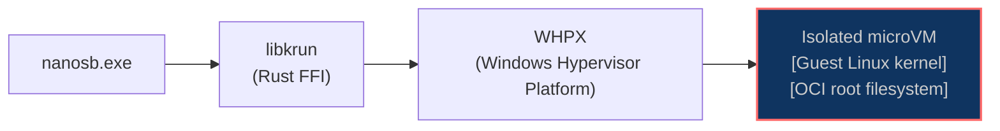
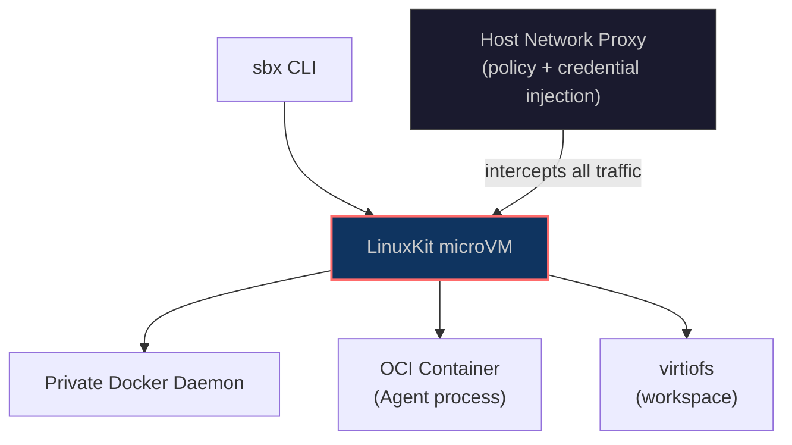

# Linux Is Hardened. Windows Is Live. The Sandbox Runs Everywhere.

*The two things we said were coming are here. This is what that took, what it looks like, and what it means now that Docker is playing the same game.*

---

## The Table That Changed

In our [first article](/articles/how-we-see-sandboxing-today), we were honest about where we stood:

| Platform | Status |
|---|---|
| Works on Linux (native) | In development (KVM) |
| Works on Windows (native) | Planned |

Both rows just changed.

Linux is production-grade — tested across four major distributions with a single binary that runs on any modern distro. Windows is live — hardware-isolated microVMs on Windows 11 via a one-line PowerShell installer. The same `nanosb` CLI, the same OCI images, the same isolation guarantees on all three platforms.

Here's what it took to get there.

---

## Linux: Hardened and Wide

Linux support was never an architectural question. libkrun uses KVM, KVM is everywhere, and the guest kernel is the same one that runs on macOS via HVF. The work was in hardening — making sure the runtime behaves correctly not just on the developer machine you happen to own, but across the distribution landscape that production teams actually run.

We tested across Ubuntu 22.04 and 24.04, Fedora 40 and 42, Debian 12, and openSUSE Leap 15.6. Each distribution has its own kernel configuration, its own glibc version, its own quirks around KVM device permissions. Some of those quirks were just quirks. Some were bugs.

The other piece is the binary itself. Shipping one build that works everywhere on Linux means choosing a glibc floor and sticking to it. We pin to version 2.28 using cargo-zigbuild — a Zig-based cross-compilation toolchain that lets us build for a specific glibc minimum without spinning up virtual machines or Docker containers to do it. The result is a single `nanosb` binary that runs on any Linux distribution shipping glibc ≥ 2.28, which covers every major distro released since 2018.

```bash
curl -fsSL https://raw.githubusercontent.com/nanosandboxai/cli/main/scripts/install.sh | bash
```

After install, `nanosb doctor` verifies the three things Linux actually needs:

```terminal
$ nanosb doctor
  ✓ libkrunfw: found at /usr/local/lib/libkrunfw.so
  ✓ KVM: /dev/kvm accessible
  ✓ gvproxy: found at /usr/local/bin/gvproxy
```

If KVM access is missing — usually a matter of adding your user to the `kvm` group — the output tells you exactly the command to run. If gvproxy isn't present, the install script has already placed it.

The KVM backend itself is stable. `nanosb run` on Linux boots the same microVM stack as macOS, with hardware-enforced isolation from the host and from every other sandbox running concurrently.

---

## Windows: Live

Windows required a different kind of work. On Linux and macOS, the hypervisor (KVM, HVF) is part of the operating system. libkrun talks directly to it. On Windows, hardware virtualization is exposed through WHPX — the Windows Hypervisor Platform — a user-mode API that sits on top of Hyper-V and gives applications direct access to the hypervisor without needing kernel-mode drivers.

The Linux kernel itself ships as `libkrunfw.dll` — a Windows DLL containing the same kernel binary compiled from the same source tree as the Linux and macOS builds. `nanosb.exe` calls into libkrun, libkrun calls into WHPX, and a microVM starts with a dedicated Linux kernel inside it.



The same OCI images, the same workspace sharing via virtiofs, the same isolation boundary — running natively on Windows without WSL, without Docker Desktop, without any third-party virtualization layer.

Installation is one PowerShell command:

```powershell
irm https://raw.githubusercontent.com/nanosandboxai/cli/v0.2.0-rc17/scripts/install.ps1 | iex
```

On a fresh Windows machine, Hyper-V and WHPX are typically not enabled. The installer detects this, enables both features automatically, and prompts for a reboot if needed. That reboot is a one-time requirement — Windows needs it to activate the hypervisor at the kernel level. The installer registers itself to resume automatically after login, so you don't need to re-run anything manually.

After the restart, the rest completes without interaction: `nanosb.exe` downloads (statically linked — no VCRUNTIME140.dll dependency), the runtime libraries land in `%USERPROFILE%\.nanosandbox\libs\`, and PATH is updated immediately in the current session.

```terminal
> nanosb doctor
  ✓ WHPX: Windows Hypervisor Platform available
  ✓ libkrunfw.dll: found at C:\Users\you\.nanosandbox\libs\libkrunfw.dll
  ✓ vsock_proxy: found
```

Windows support is experimental. The core path — boot a microVM, run an agent, stream output — works. Edge cases in networking, long-running sessions, and multi-sandbox scenarios are still being worked through.

---

## Security: Secrets That Never Leave the Wire in Plaintext

AI agents run autonomously. They pull from private repos, call paid APIs, sign artifacts. That means credentials — API keys, tokens, TLS client certs — flow into the sandbox at session start and stay resident while the agent works. If those secrets travel in cleartext between host and guest, a compromised host process or a noisy log can leak them. If they land in `.env` files or shell exports inside the VM, a rogue agent tool can read them from disk or `/proc`.

Nanosandbox now encrypts every secret before it crosses the host-guest boundary. The host generates an ephemeral X25519 ECDH keypair, derives a shared secret with the gateway's public key, and encrypts each value with AES-256-GCM. The ciphertext travels over vsock to the guest, where the gateway decrypts it using its one-shot private key — zeroed immediately after first use. Decrypted values are injected into agent processes via `execve` environment, never written to disk, never exported through a shell.

For teams, secrets can be sourced from SOPS-encrypted files (Mozilla SOPS), so credentials stay encrypted at rest in version control. Sensitive files — TLS keys, service account JSON — are intercepted from the project mount, written to tmpfs inside the VM with `0400` permissions, and removed from the workspace mount before the agent sees them.

The previous approach passed environment variables in plaintext. Docker sbx takes a different path: a host-side proxy intercepts outbound traffic and injects credentials for a fixed list of known services. Nanosandbox encrypts at the source and decrypts at the destination — no proxy, no fixed service list, no plaintext on the wire.

---

## The Updated Landscape

With Linux hardened and Windows live, the comparison table from the first article needs updating:

| Approach | Isolation | Kernel | macOS | Linux | Windows | Local |
|---|---|---|---|---|---|---|
| **No isolation** | None | Shared | Yes | Yes | Yes | Yes |
| **Containers** | Namespaces + cgroups | Shared | Via VM | Yes | Via WSL | Yes |
| **gVisor** | User-space kernel | Intercepted | No | Yes | No | Yes |
| **Firecracker / E2B** | Hardware (KVM) | Dedicated | No | Yes (cloud) | No | No |
| **Docker sbx** | Hardware (HVF/WHP/KVM) | Dedicated | Yes | Experimental | Experimental | Yes |
| **Nanosandbox** | Hardware (HVF/WHPX/KVM) | Dedicated | **Yes** | **Yes** | **Yes** | **Yes** |

| Approach | Credentials / Secrets |
|---|---|
| **No isolation** | Plaintext env vars |
| **Containers** | Plaintext env vars / Docker secrets |
| **gVisor** | Plaintext env vars |
| **Firecracker / E2B** | Plaintext env vars |
| **Docker sbx** | Host proxy (fixed service list) |
| **Nanosandbox** | Encrypted pipeline (X25519 + AES-256-GCM, one-shot keys) |

The cloud-first services run somewhere else on your behalf. Of the tools that run locally, only Docker sbx and Nanosandbox provide hardware-enforced isolation across all three platforms. Which brings us to Docker.

---

## Docker sbx: The Same Conviction, A Different Architecture

On March 31, 2026, Docker shipped `sbx` — a standalone CLI for running AI agents in microVM sandboxes. Not containers. Virtual machines. Dedicated kernels. Hardware isolation.

When Docker — the company that made containers the default unit of isolation — ships a microVM sandbox and calls it "run agents in YOLO mode, safely", that's a signal. The industry has made up its mind about what autonomous AI agents need.

`sbx` supports Claude Code, Codex, Cursor, Goose, and Gemini CLI. It runs on macOS, Windows 11, and Linux. It's experimental and free. Under the hood, each sandbox is a LinuxKit microVM — the same class of hardware-enforced isolation that Nanosandbox uses, on the same hypervisors: HVF on macOS, WHP on Windows, KVM on Linux.



The VM boots a private Docker daemon inside it. The agent runs as an OCI container inside that daemon. A host-side proxy intercepts all outbound traffic, enforces network policy, and injects credentials — so API keys never enter the VM.

### The Same Foundation, Different Choices

Both tools agree on the foundation: microVM per agent, hardware-enforced isolation, virtiofs for workspace, native hypervisors. Where they diverge is in what lives inside the VM.

Docker's approach carries the entire Docker runtime into the sandbox. Every sandbox boots a full Docker daemon — containerd, dockerd, the works. Agents that need to build images or run compose have a complete Docker environment available. The experience is familiar. It's Docker, just with real walls around it.

That familiarity has costs. The VM-plus-daemon stack pushes startup times into the half-second to one-second range. Network policy is enforced by the host proxy, but only for a fixed list of known services — GitHub, GitLab, Docker Hub, and a handful of others. Arbitrary credentials don't flow through; if the proxy doesn't know the service, the agent doesn't reach it. And `sbx login` is required on first run — a Docker OAuth flow ties the tool to an account, which is a blocker for air-gapped environments or teams that don't want their agent tooling phoning home.

Nanosandbox takes the opposite position. The VMM is libkrun — a Rust library that wraps KVM and HVF into a minimal API. No daemon lives inside the guest. OCI images are extracted directly into the root filesystem. The VM boots, the agent runs, the sandbox is destroyed. Sub-300ms boot times, no cloud account, no fixed service list — credentials flow in as environment variables the way you'd expect.

The tradeoff is real: agents that depend on Docker-native workflows inside the sandbox don't have a daemon to talk to. Nanosandbox is optimized for the execution boundary, not for replicating Docker's feature set inside it.

| | Docker sbx | Nanosandbox |
|---|---|---|
| **Isolation model** | microVM (LinuxKit) | microVM (libkrun) |
| **Hypervisor** | HVF / WHP / KVM | HVF / WHPX / KVM |
| **Inside the VM** | Private Docker daemon + OCI container | OCI root filesystem only |
| **Startup time** | ~500ms–1s | ~100–300ms |
| **OCI images** | Via private Docker daemon | Direct extraction, any registry |
| **Credentials** | Host proxy (fixed service list) | Encrypted pipeline (X25519 + AES-256-GCM, one-shot keys) |
| **Cloud account** | Required (`sbx login`) | Not required |
| **Agent-to-agent isolation** | Hardware (VM per sandbox) | Hardware (VM per sandbox) |
| **Linux support** | Experimental (Ubuntu 24.04+) | Hardened (Ubuntu / Fedora / Debian / openSUSE) |
| **Windows support** | Experimental (Win 11) | Experimental (Win 11) |
| **macOS support** | Production | Production |
| **Open source** | No | Yes |

Neither is wrong. If your team lives in Docker and your agents need the Docker runtime inside the sandbox, `sbx` is the natural fit. If you want the lightest possible isolation layer — local-first, no cloud dependency, any registry — that's the other side of the tradeoff.

What matters is that both tools exist, both are shipping, and both are built on the same conviction: containers are not enough for autonomous agents. Hardware isolation is the floor.

---

## Closing Thoughts

A year ago, the comparison table in our first article had two honest admissions: Linux in development, Windows planned. Both are done. The same `nanosb` CLI, the same OCI images, the same hardware-isolated microVM boundary — on macOS, Linux, and Windows.

The fact that Docker shipped `sbx` in the same window tells the rest of the story. MicroVM isolation for AI agents is no longer an architectural opinion. It's becoming the baseline.

The walls around your AI agent should be made of silicon, not software.

---

## Sources

- [Docker Sandboxes — Official Docs](https://docs.docker.com/ai/sandboxes/) — Architecture, security model, isolation layers, and CLI reference for the `sbx` tool.
- [Docker Blog: "Docker Sandboxes: Run Agents in YOLO Mode, Safely"](https://www.docker.com/blog/docker-sandboxes-run-agents-in-yolo-mode-safely/) — Launch post, March 31, 2026.
- [Docker Blog: "Why MicroVMs: The Architecture Behind Docker Sandboxes"](https://www.docker.com/blog/why-microvms-the-architecture-behind-docker-sandboxes/) — Deep dive into LinuxKit, virtiofs, and the four-layer isolation model, April 16, 2026.
- [GitHub — docker/sbx-releases](https://github.com/docker/sbx-releases) — Release history, known issues, and changelog for the `sbx` CLI.
- [OWASP Top 10 for Agentic Applications (2026)](https://genai.owasp.org/resource/owasp-top-10-for-agentic-applications-for-2026/) — ASI01 Agent Goal Hijack, ASI05 Unexpected Code Execution, and the full agentic threat taxonomy.
- [runc Container Escape Vulnerabilities](https://github.com/opencontainers/runc/security/advisories) — CVE-2025-31133, CVE-2025-52565, CVE-2025-52881: `/proc`-based container escapes exploitable from custom mount configurations.
- [libkrun — containers/libkrun](https://github.com/containers/libkrun) — Lightweight microVM library from the Containers project, providing KVM (Linux), HVF (macOS), and WHPX (Windows) virtualization.
- [Firecracker: Lightweight Virtualization for Serverless Computing](https://firecracker-microvm.github.io/) — AWS's microVM monitor powering Lambda and Fargate.
- [E2B — Cloud Sandboxes for AI Agents](https://e2b.dev/) — Firecracker-based ephemeral sandboxes with JavaScript and Python SDKs.
- [Daytona — Infrastructure for AI-Generated Code](https://www.daytona.io/) — OCI-compliant sandboxes with per-sandbox firewall rules and multi-language SDKs.

---

*Nanosandbox is open source. Find us at [github.com/nanosandboxai](https://github.com/nanosandboxai).*
