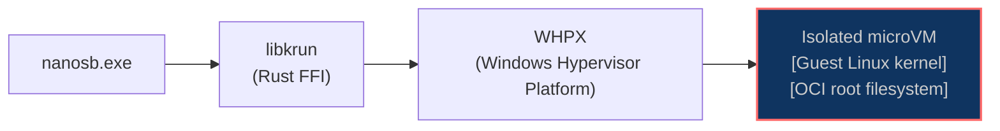
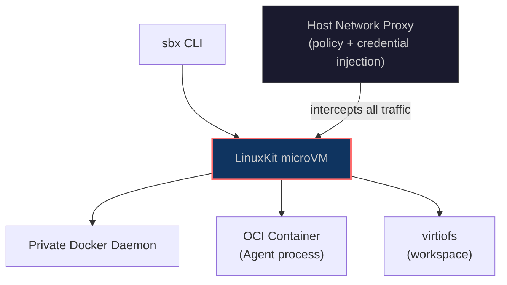

# Linux Is Hardened. Windows Is Live. The Sandbox Runs Everywhere.

*v0.2.0 marks an inflection point for the runtime. Linux hardening is complete, Windows microVM support is live, and secret handling for `.env` workflows now follows an encrypted end-to-end path. This post explains the engineering choices behind those changes and how they compare with Docker sbx.*

---

## The Table That Changed

In our [first article](/articles/how-we-see-sandboxing-today), we were honest about where we stood:

| Platform | Status |
|---|---|
| Works on Linux (native) | In development (KVM) |
| Works on Windows (native) | Planned |

Both rows just changed.

Linux is production-grade. We tested it across major distributions with one binary that runs on modern systems. Windows is live and now provides hardware-isolated microVMs on Windows 11 through a one-line PowerShell installer. The same `nanosb` CLI, the same OCI images, and the same isolation guarantees now apply across all three platforms.

Here's what it took to get there.

---

## Linux: Hardened and Wide

Linux support was never blocked by architecture. libkrun uses KVM, and KVM is broadly available. The guest kernel also matches the one used on macOS through HVF. The hard part was runtime hardening across the distributions production teams actually run.

We tested across Ubuntu 24.04, Debian 12, Fedora 40, Arch Linux, and openSUSE Tumbleweed. Each distribution has its own kernel configuration, its own glibc version, its own quirks around KVM device permissions. Some of those quirks were just quirks. Some were bugs. The binary itself is built against a glibc 2.28 floor, so it also runs on older long-term releases (for example Ubuntu 22.04, Debian 11) that ship glibc 2.28 or newer.


| Distribution | Version tested in CI | Status |
|---|---|---|
| Ubuntu | 24.04 LTS | Stable |
| Debian | 12 | Stable |
| Fedora | 40 | Stable |
| Arch Linux | rolling | Stable |
| openSUSE | Tumbleweed | Stable |

The other piece is the binary itself. Shipping one build across Linux means choosing a glibc floor and holding it. We pin to version 2.28 with cargo-zigbuild. This Zig-based cross-compilation toolchain targets a specific glibc minimum without requiring build VMs or Docker containers. The result is one `nanosb` binary that runs on distributions with glibc >= 2.28. That covers major distros released since 2018.


```bash
curl -fsSL https://github.com/nanosandboxai/cli/releases/latest/download/install.sh | bash
```


After install, `nanosb doctor` verifies the three things Linux actually needs:


```terminal
$ nanosb doctor

Checking runtime prerequisites...

  [✓] libkrunfw Kernel Firmware: found (libkrunfw.so.5)
  [✓] KVM Device: /dev/kvm accessible
  [✓] gvproxy: available (full outbound networking)

3 checks passed, 0 errors, 0 warnings

Ready to run sandboxes.
```

If KVM access is missing, the user is usually not in the `kvm` group. The output prints the exact command to fix it. If `gvproxy` is missing, the installer places it automatically.

The KVM backend itself is stable. `nanosb run` on Linux boots the same microVM stack as macOS, with hardware-enforced isolation from the host and from every other sandbox running concurrently.

---

## Windows: Live

Windows required a different integration path. On Linux and macOS, the hypervisor layer (KVM or HVF) is part of the operating system, and libkrun talks to it directly. On Windows, hardware virtualization is exposed through WHPX. WHPX is a user-mode API on top of Hyper-V. It gives applications direct access to the hypervisor without kernel drivers.

The Linux kernel ships as `libkrunfw.dll`, a Windows DLL that contains the same kernel binary built from the same source tree as Linux and macOS. `nanosb.exe` calls libkrun. libkrun then calls WHPX. The microVM boots with its own dedicated Linux kernel.




The runtime behavior stays the same. OCI images are unchanged, workspace sharing still uses virtiofs, and the isolation boundary is the same. It runs natively on Windows without WSL, Docker Desktop, or third-party virtualization layers.


Installation is one PowerShell command:


```powershell
irm https://raw.githubusercontent.com/nanosandboxai/cli/main/scripts/install.ps1 | iex
```


On a fresh Windows machine, Hyper-V and WHPX are often disabled. The installer detects this and enables both features automatically. It prompts for reboot when needed. The reboot is a one-time requirement because Windows activates the hypervisor at kernel level. After login, the installer resumes automatically.

After restart, setup completes without interaction. `nanosb.exe` downloads as a statically linked binary with no `VCRUNTIME140.dll` dependency. Runtime libraries are placed in `%USERPROFILE%\.nanosandbox\libs\`. PATH is updated in the current session.


```terminal
> nanosb doctor

Checking runtime prerequisites...

  [✓] HCS Service: running (vmcompute)
  [✓] Hyper-V Access: user has Hyper-V access (admin or Hyper-V Administrators)
  [✓] WSL Kernel: found
  [✓] libkrunfw.dll: found
  [✓] busybox: found
  [✓] vsock_proxy: found
  [✓] fuse_mount: found
  [✓] Disk: SSD detected
  [✓] Memory: sufficient RAM available

9 checks passed, 0 errors, 0 warnings

Ready to run sandboxes.
```

Windows support is experimental, but the day-to-day workspace path is now much closer to Linux and macOS. Files and folders that tools create, replace, and clean up during builds now behave the way most developers expect, which removes a lot of the friction around package installs and test runs.

There are still a few advanced file-system behaviors we are tightening. For now, those cases fall back to safe defaults, while normal development loops stay reliable. We cover those details in the docs so this article can stay focused on the bigger platform story.

---

## Security: Safer Env and `.env` Flows by Default

AI agents run autonomously. They pull from private repos, call paid APIs, and sign artifacts. So credentials such as API keys, tokens, and TLS client certificates flow into the sandbox at session start and stay resident while the agent runs. If those values travel in cleartext between host and guest, a compromised host process or noisy logging path can leak them. If they are materialized as `.env` files or broad shell exports inside the VM, a rogue tool can read them from disk or `/proc`.

In v0.2.0, Nanosandbox encrypts secret values before they cross the host-guest boundary. The host generates an ephemeral X25519 ECDH keypair. It derives a shared secret with the gateway's public key, hashes it with SHA-256 to produce the AES-256-GCM key, and encrypts each value with that key. The ciphertext travels over vsock to the guest. The gateway decrypts it with a one-shot private key that is zeroed after first use.

Operationally, this changes how env handling behaves:

- Secrets from host env or `.env`-style inputs are encrypted before transport.
- Decrypted values are injected directly into the target process via `execve` env.
- Values are not persisted as guest `.env` files.
- Values are not exported through interactive shells by default.
- One-shot key material is wiped after decryption.


### Linux Runtime Hardening Beyond Secret Transport

v0.2.0 also hardens the Linux guest runtime itself. Secret transport is one part of the model. We also tightened what code inside the VM can do after boot.

- `/proc` is mounted with `hidepid=2`, so one process cannot inspect another process environment.
- `noNewPrivileges` is enforced, which blocks privilege gain through setuid and setgid transitions.
- A seccomp profile blocks 34 high-risk syscalls, including `ptrace`, `bpf`, `io_uring_*`, `userfaultfd`, and kernel or module control calls.
- Sensitive kernel surfaces are masked or read-only, including `/proc/sys`, `/proc/kcore`, `/proc/keys`, `/sys/firmware`, and `/proc/sysrq-trigger`.
- Kernel attack paths are reduced further by disabling module loading and `kexec` in the guest kernel configuration.

Docker sbx takes a different path. A host-side proxy intercepts outbound traffic and injects credentials for a fixed list of known services. Nanosandbox encrypts env payloads at the source and decrypts them at the destination. This removes the proxy model, avoids a fixed service list, and keeps plaintext off the wire.

---

## The Updated Landscape

With Linux hardened and Windows live, the comparison table from the first article needs updating:


| Approach | Isolation | Kernel | macOS | Linux | Windows | Local |
|---|---|---|---|---|---|---|
| **No isolation** | None | Shared | Yes | Yes | Yes | Yes |
| **Containers** | Namespaces + cgroups | Shared | Via VM | Yes | Via WSL | Yes |
| **gVisor** | User-space kernel | Intercepted | No | Yes | No | Yes |
| **Firecracker / E2B** | Hardware (KVM) | Dedicated | No | Yes (cloud) | No | No |
| **Docker sbx** | Hardware (HVF/WHP/KVM) | Dedicated | Yes | Experimental | Experimental | Yes |
| **Nanosandbox** | Hardware (HVF/WHPX/KVM) | Dedicated | **Yes** | **Yes** | **Yes** | **Yes** |


| Approach | Credentials / Secrets |
|---|---|
| **No isolation** | Plaintext env vars |
| **Containers** | Plaintext env vars / Docker secrets |
| **gVisor** | Plaintext env vars |
| **Firecracker / E2B** | Plaintext env vars |
| **Docker sbx** | Host proxy (fixed service list) |
| **Nanosandbox** | Encrypted pipeline (X25519 + AES-256-GCM, one-shot keys) |

The cloud-first services run somewhere else on your behalf. Of the tools that run locally, only Docker sbx and Nanosandbox provide hardware-enforced isolation across all three platforms. Which brings us to Docker.

---

## Docker sbx: The Same Conviction, A Different Architecture

On March 31, 2026, Docker shipped `sbx`, a standalone CLI for running AI agents in microVM sandboxes. Not containers. Virtual machines with dedicated kernels and hardware isolation.

When Docker, the company that made containers the default unit of isolation, ships a microVM sandbox and positions it as safe YOLO mode for agents, the signal is clear. The industry is converging on what autonomous agents need.

`sbx` supports Claude Code, Codex, Cursor, Goose, and Gemini CLI. It runs on macOS, Windows 11, and Linux. It is experimental and free. Under the hood, each sandbox is a LinuxKit microVM. This is the same class of hardware-enforced isolation used by Nanosandbox on HVF (macOS), WHP (Windows), and KVM (Linux).




The VM boots a private Docker daemon inside it. The agent runs as an OCI container inside that daemon. A host-side proxy intercepts outbound traffic, enforces network policy, and injects credentials so API keys never enter the VM.

### The Same Foundation, Different Choices

Both tools agree on the foundation. Each agent gets a microVM, hardware-enforced isolation, virtiofs workspace sharing, and native hypervisors. The main difference is what runs inside the VM.

Docker's approach carries the full Docker runtime into the sandbox. Every sandbox boots a full daemon stack with containerd and dockerd. Agents that build images or run compose get a complete Docker environment. The experience is familiar and keeps existing Docker workflows intact.

That familiarity has costs. The VM-plus-daemon stack pushes startup times into the half-second to one-second range. Network policy is enforced by a host proxy and currently targets a fixed list of known services such as GitHub, GitLab, and Docker Hub. Arbitrary credentials do not flow through when a service is outside that list. `sbx login` is also required on first run through a Docker OAuth flow. This can block air-gapped environments or teams that avoid account-bound tooling.

Nanosandbox takes the opposite position. The VMM is libkrun, a Rust library that wraps KVM and HVF behind a minimal API. No daemon lives inside the guest. OCI images are extracted directly into the root filesystem. The VM boots, the agent runs, and the sandbox is destroyed. No cloud account is required. Credentials can flow as environment variables without a fixed service list.

The tradeoff is real. Agents that depend on Docker-native workflows inside the sandbox do not have a daemon to talk to. Nanosandbox is optimized for the execution boundary, not for replicating Docker's full feature set inside it.


| | Docker sbx | Nanosandbox |
|---|---|---|
| **Isolation model** | microVM (LinuxKit) | microVM (libkrun) |
| **Hypervisor** | HVF / WHP / KVM | HVF / WHPX / KVM |
| **Inside the VM** | Private Docker daemon + OCI container | OCI root filesystem only |
| **OCI images** | Via private Docker daemon | Direct extraction, any registry |
| **Credentials** | Host proxy (fixed service list) | Encrypted pipeline (X25519 + AES-256-GCM, one-shot keys) |
| **Cloud account** | Required (`sbx login`) | Not required |
| **Agent-to-agent isolation** | Hardware (VM per sandbox) | Hardware (VM per sandbox) |
| **Linux support** | Experimental (Ubuntu 24.04+) | Hardened (Ubuntu / Fedora / Debian / openSUSE) |
| **Windows support** | Experimental (Win 11) | Experimental (Win 11, workspace parity) |
| **macOS support** | Production | Production |
| **Open source** | No | Yes |

Neither approach is wrong. If your team is deeply invested in Docker and agents need the Docker runtime inside the sandbox, `sbx` is a natural fit. If you want a lighter isolation layer with local-first operation, no cloud dependency, and broad OCI registry support, Nanosandbox is likely the better fit.

What matters is that both tools exist, both are shipping, and both are built on the same conviction. Containers are not enough for autonomous agents. Hardware isolation is the floor.

---

## Coming Soon

We are already working on the next layer above the runtime. Four tracks are in progress.

### 1) SDKs for multiple languages

Today, Nanosandbox is easiest to adopt through the CLI. The next step is first-class SDK support so teams can embed sandbox orchestration directly in their own stacks. The current target set includes Python, TypeScript, Go, Rust, Java, and C#.

### 2) Custom deep agents in the sandbox

We are building a path for teams to bring their own deep agents and run them as first-class sandbox workloads. The goal is to make custom agent development part of the same isolation model, lifecycle controls, and observability that power the built-in flows.

### 3) Caging tournament for code agents

We are preparing a public caging tournament where code agents are pushed against controlled escape challenges. The objective is simple. Measure whether agents can break containment, document failure modes, and use the results to harden the sandbox boundary over time.

### 4) More code agents and ongoing improvements

Support for more code agents is in progress, including Gemini CLI and Grok CLI. We are also working on continuous quality improvements across onboarding, runtime stability, and day-to-day developer experience.

---

## Closing Thoughts

With v0.2.0, the platform story is materially different from our first article. Linux is hardened, Windows is live, and secret handling for env workflows is stronger by default. The same `nanosb` CLI, the same OCI images, and the same hardware-isolated microVM boundary now apply on macOS, Linux, and Windows.

The fact that Docker shipped `sbx` in the same window tells the rest of the story. MicroVM isolation for AI agents is no longer an architectural opinion. It's becoming the baseline.

The walls around your AI agent should be made of silicon, not software.

---

## Sources

- [Docker Sandboxes — Official Docs](https://docs.docker.com/ai/sandboxes/) — Architecture, security model, isolation layers, and CLI reference for the `sbx` tool.
- [Docker Blog: "Docker Sandboxes: Run Agents in YOLO Mode, Safely"](https://www.docker.com/blog/docker-sandboxes-run-agents-in-yolo-mode-safely/) — Launch post, March 31, 2026.
- [Docker Blog: "Why MicroVMs: The Architecture Behind Docker Sandboxes"](https://www.docker.com/blog/why-microvms-the-architecture-behind-docker-sandboxes/) — Deep dive into LinuxKit, virtiofs, and the four-layer isolation model, April 16, 2026.
- [GitHub — docker/sbx-releases](https://github.com/docker/sbx-releases) — Release history, known issues, and changelog for the `sbx` CLI.
- [OWASP Top 10 for Agentic Applications (2026)](https://genai.owasp.org/resource/owasp-top-10-for-agentic-applications-for-2026/) — ASI01 Agent Goal Hijack, ASI05 Unexpected Code Execution, and the full agentic threat taxonomy.
- [runc Container Escape Vulnerabilities](https://github.com/opencontainers/runc/security/advisories) — CVE-2025-31133, CVE-2025-52565, CVE-2025-52881: `/proc`-based container escapes exploitable from custom mount configurations.
- [libkrun — containers/libkrun](https://github.com/containers/libkrun) — Lightweight microVM library from the Containers project, providing KVM (Linux), HVF (macOS), and WHPX (Windows) virtualization.
- [Firecracker: Lightweight Virtualization for Serverless Computing](https://firecracker-microvm.github.io/) — AWS's microVM monitor powering Lambda and Fargate.
- [E2B — Cloud Sandboxes for AI Agents](https://e2b.dev/) — Firecracker-based ephemeral sandboxes with JavaScript and Python SDKs.
- [Daytona — Infrastructure for AI-Generated Code](https://www.daytona.io/) — OCI-compliant sandboxes with per-sandbox firewall rules and multi-language SDKs.

---

*Nanosandbox is open source. Find us at [github.com/nanosandboxai](https://github.com/nanosandboxai).*
