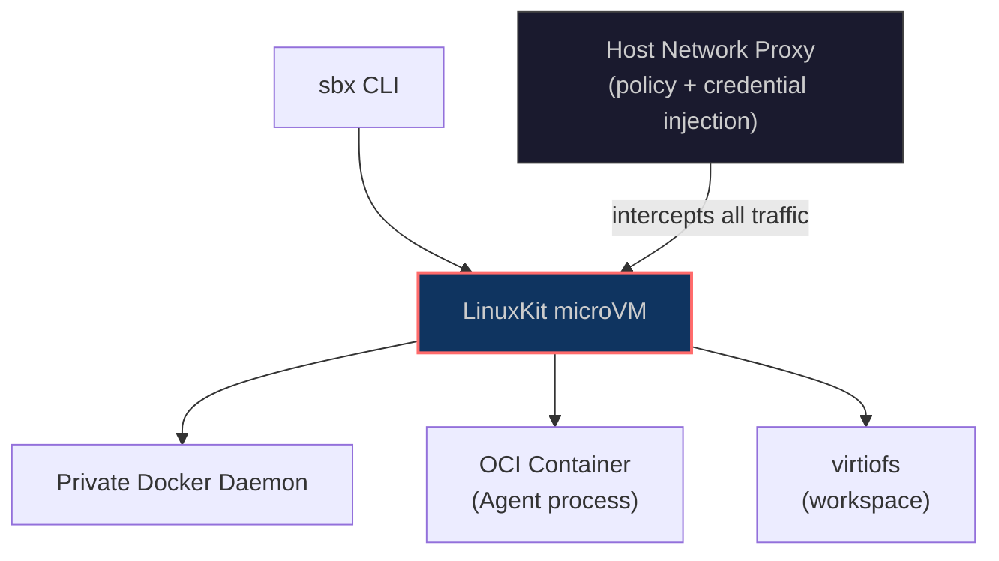
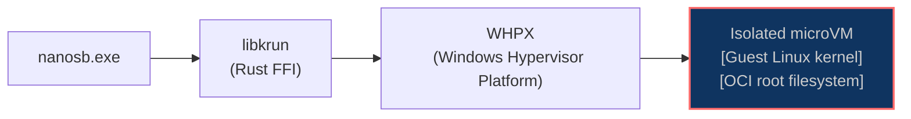

# Docker Just Proved Containers Aren't Enough — And We Agree

*When Docker ships its own microVM sandbox and calls it "run agents in YOLO mode, safely", that's not a product launch. That's an admission.*

---

## The Table That Changed

In our [first article](/articles/how-we-see-sandboxing-today), we published a comparison table. Two rows stood out:

| Platform | Status |
|---|---|
| Works on Linux (native) | In development (KVM) |
| Works on Windows (native) | Planned |

Both rows just changed.

Linux is hardened — tested across Ubuntu, Fedora, Debian, and openSUSE with a single binary that runs on any modern distro. Windows is live — WHPX-backed microVMs on Windows 11 with a one-line PowerShell installer.

But the bigger story happened at Docker.

---

## Docker Said the Quiet Part Out Loud

On March 31, 2026, Docker shipped `sbx` — a standalone CLI for running AI coding agents in microVM sandboxes. Not containers. Virtual machines. Each with a dedicated Linux kernel, hardware-enforced memory isolation, and a host-side proxy that controls every byte of network traffic.

They called it "run agents in YOLO mode, safely."

We've been saying the same thing for a year.

The launch matters not because Docker built something surprising, but because of what it signals when Docker — the company that made containers synonymous with isolation — decides containers aren't the right boundary for AI agents. The threat model changed. Autonomous agents execute arbitrary code from arbitrary repositories. A shared kernel is not an acceptable wall for that workload. Docker knows this, we know this, and now the industry has an unambiguous signal.

`sbx` supports Claude Code, Codex, Cursor, Goose, and Gemini CLI out of the box. It runs on macOS, Windows 11, and Linux. It's experimental, free, and requires no Docker Desktop license. Under the hood, each sandbox is a LinuxKit microVM — the same class of hardware-enforced isolation that Nanosandbox uses.

Here's how it's structured:



The VM boots a private Docker daemon inside it. The agent runs as an OCI container inside that daemon. The host-side proxy intercepts all outbound traffic, enforces network policy, and injects credentials on demand — so your API keys never enter the VM. The workspace is shared via virtiofs.

It works. And it's a thoughtful architecture for teams already living inside the Docker ecosystem.

---

## The Same Foundation, Different Choices

Both Docker sbx and Nanosandbox agree on the foundation: hardware-enforced isolation, virtiofs for workspace sharing, native hypervisors on each platform — Apple's Hypervisor.framework on macOS, Windows Hypervisor Platform on Windows, KVM on Linux. This isn't a coincidence. It's the only architecture that genuinely solves the threat model for autonomous AI agents.

Where they diverge is in what lives inside the VM.

### Docker sbx: Docker in a VM

Docker's approach carries Docker's entire runtime into the sandbox. Every sandbox boots a full Docker daemon — containerd, dockerd, the works. Agents that need to build images or spin up services have a full Docker environment available. The experience is familiar. It's Docker, just with real walls around it.

That familiarity has costs. The VM-plus-daemon stack pushes startup times into the half-second to one-second range. Memory was originally capped at 4GB per sandbox. Network policy is enforced by the host proxy, but only across a fixed list of known services — GitHub, GitLab, Docker Hub, and a handful of others. Arbitrary credentials don't flow through; the proxy either knows the service or the agent doesn't get network access to it.

There's also a cloud dependency baked into the first step. `sbx login` runs an OAuth flow that ties the tool to a Docker account. For teams in regulated industries, air-gapped environments, or shops that simply don't want their agent tooling phoning home, this is a wall before the first sandbox starts.

### Nanosandbox: Minimal isolation, library-first

Nanosandbox takes the opposite position. The VMM is libkrun — a Rust library from the Containers project that wraps KVM and HVF into a minimal API. No daemon lives inside the guest. OCI images are pulled from any registry and extracted directly into the root filesystem. The VM boots, the agent runs, the sandbox is destroyed.

The result is a lighter footprint: sub-300ms boot times, no cloud account, no fixed service list for credentials. Environment variables work the way you'd expect. And because libkrun is a library rather than a daemon process, it embeds directly into a CLI or an IDE plugin without adding process management overhead.

The tradeoff is real. Agents that depend on Docker-native workflows — building images inside the sandbox, running compose — don't have a daemon to talk to. Nanosandbox is optimized for the execution boundary, not for replicating Docker's feature surface inside it.

| | Docker sbx | Nanosandbox |
|---|---|---|
| **Isolation model** | microVM (LinuxKit) | microVM (libkrun) |
| **Hypervisor** | HVF / WHP / KVM | HVF / WHPX / KVM |
| **Inside the VM** | Private Docker daemon + OCI container | OCI root filesystem only |
| **Startup time** | ~500ms–1s | ~100–300ms |
| **OCI images** | Via private Docker daemon | Direct extraction, any registry |
| **Credentials** | Host proxy (fixed service list) | Environment variables |
| **Cloud account** | Required (`sbx login`) | Not required |
| **Agent-to-agent isolation** | Hardware (VM per sandbox) | Hardware (VM per sandbox) |
| **Linux support** | Experimental (Ubuntu 24.04+) | Hardened (Ubuntu / Fedora / Debian / openSUSE) |
| **Windows support** | Experimental (Win 11) | Experimental (Win 11) |
| **macOS support** | Production | Production |
| **Open source** | No | Yes |

Neither approach is wrong. They're built for different defaults. If your team lives in Docker and your agents need Docker inside the sandbox, `sbx` is the natural extension of that workflow. If you want the lightest possible isolation layer, local-first, with no cloud dependency, Nanosandbox sits on the other side of that tradeoff.

---

## Linux: Hardened and Wide

Linux support moved from "functional" to production-grade. The change isn't architectural — the KVM backend was always correct. It's the kind of hardening that comes from coverage: running the full test suite across Ubuntu 22.04 and 24.04, Fedora 40 and 42, Debian 12, and openSUSE Leap 15.6. Finding the edge cases. Fixing them.

One binary runs everywhere. We pin the glibc floor to version 2.28 using cargo-zigbuild, which means the same download works on any modern Linux distribution without recompilation or manual dependency management.

```bash
curl -fsSL https://raw.githubusercontent.com/nanosandboxai/cli/main/scripts/install.sh | bash
```

After install, `nanosb doctor` checks the three things Linux actually needs:

```terminal
$ nanosb doctor
  ✓ libkrunfw: found at /usr/local/lib/libkrunfw.so
  ✓ KVM: /dev/kvm accessible
  ✓ gvproxy: found at /usr/local/bin/gvproxy
```

If KVM access is missing, the output tells you exactly which group to join. If gvproxy isn't present, the install script has already handled it.

Docker sbx on Linux requires Ubuntu 24.04 specifically and manual KVM group setup. That distribution breadth gap matters in practice — plenty of teams still run Debian 12 or Fedora on their workstations, and "upgrade your distro to use the sandbox" is not a reasonable ask.

---

## Windows: Live

The architecture on Windows follows the same shape as macOS and Linux: libkrun wraps the platform hypervisor, a Linux kernel boots inside the VM, the agent runs in a hardware-isolated environment.

On Windows, the hypervisor is WHPX — Windows Hypervisor Platform. The Linux kernel ships as `libkrunfw.dll`, a Windows DLL that embeds the kernel binary compiled from the same source as the Linux and macOS builds. `nanosb.exe` calls into libkrun, libkrun calls into WHPX, and a microVM starts.



Installation is one PowerShell command:

```powershell
irm https://raw.githubusercontent.com/nanosandboxai/cli/v0.2.0-rc17/scripts/install.ps1 | iex
```

The installer checks for Hyper-V and WHPX. If either is disabled — which is the case on most fresh Windows machines — it enables both automatically. These are Windows optional features that require a kernel-level activation, so on a fresh machine you'll see a restart prompt. The installer handles this gracefully: it registers itself to auto-resume after login, so you walk away from the reboot and come back to a finished installation with no manual steps.

After the restart, the binary downloads (`nanosb.exe` is statically linked — no VCRUNTIME140.dll required), runtime libraries land in `%USERPROFILE%\.nanosandbox\libs\`, and PATH is updated immediately in the current session.

Docker sbx on Windows shares the same hardware requirement — WHPX must be enabled — but its setup doesn't automate the Windows feature activation. The gap in setup experience is meaningful for a tool positioned at developers who just want to run an agent safely.

---

## The Updated Landscape

The table from our first article had two rows that needed updating. Here's where things stand:

| Approach | Isolation | Kernel | macOS | Linux | Windows | Local |
|---|---|---|---|---|---|---|
| **No isolation** | None | Shared | Yes | Yes | Yes | Yes |
| **Containers** | Namespaces + cgroups | Shared | Via VM | Yes | Via WSL | Yes |
| **gVisor** | User-space kernel | Intercepted | No | Yes | No | Yes |
| **Firecracker / E2B** | Hardware (KVM) | Dedicated | No | Yes (cloud) | No | No |
| **Docker sbx** | Hardware (HVF/WHP/KVM) | Dedicated | Yes | Experimental | Experimental | Yes |
| **Nanosandbox** | Hardware (HVF/WHPX/KVM) | Dedicated | **Yes** | **Yes** | **Yes** | **Yes** |

The cloud-first services run somewhere else on your behalf. Of the local options, only Docker sbx and Nanosandbox provide hardware-enforced isolation on all three platforms. That's the field.

---

## Closing Thoughts

Docker shipping `sbx` is the clearest signal yet that the industry has made up its mind. Containers isolate well-behaved microservices from each other. They were never designed to contain an autonomous agent executing arbitrary code from arbitrary repositories. The shared kernel is a known, repeatedly exploited surface, and no seccomp profile or AppArmor policy makes it the right boundary for this threat model.

The question has shifted from *whether* to isolate with hardware to *how much* to put inside the VM. Docker's answer is: bring the whole runtime. Ours is: bring only what you need.

Both `sbx` and Nanosandbox run on macOS today, Linux in hardened state, and Windows in early access. The microVM approach is no longer an architectural opinion — it's becoming the baseline.

The walls around your AI agent should be made of silicon, not software.

---

## Sources

- [Docker Sandboxes — Official Docs](https://docs.docker.com/ai/sandboxes/) — Architecture, security model, isolation layers, and CLI reference for the `sbx` tool.
- [Docker Blog: "Docker Sandboxes: Run Agents in YOLO Mode, Safely"](https://www.docker.com/blog/docker-sandboxes-run-agents-in-yolo-mode-safely/) — Launch post, March 31, 2026.
- [Docker Blog: "Why MicroVMs: The Architecture Behind Docker Sandboxes"](https://www.docker.com/blog/why-microvms-the-architecture-behind-docker-sandboxes/) — Deep dive into LinuxKit, virtiofs, and the four-layer isolation model, April 16, 2026.
- [GitHub — docker/sbx-releases](https://github.com/docker/sbx-releases) — Release history, known issues, and changelog for the `sbx` CLI.
- [OWASP Top 10 for Agentic Applications (2026)](https://genai.owasp.org/resource/owasp-top-10-for-agentic-applications-for-2026/) — ASI01 Agent Goal Hijack, ASI05 Unexpected Code Execution, and the full agentic threat taxonomy.
- [runc Container Escape Vulnerabilities](https://github.com/opencontainers/runc/security/advisories) — CVE-2025-31133, CVE-2025-52565, CVE-2025-52881: `/proc`-based container escapes exploitable from custom mount configurations.
- [libkrun — containers/libkrun](https://github.com/containers/libkrun) — Lightweight microVM library from the Containers project, providing KVM (Linux), HVF (macOS), and WHPX (Windows) virtualization.
- [Firecracker: Lightweight Virtualization for Serverless Computing](https://firecracker-microvm.github.io/) — AWS's microVM monitor powering Lambda and Fargate.
- [E2B — Cloud Sandboxes for AI Agents](https://e2b.dev/) — Firecracker-based ephemeral sandboxes with JavaScript and Python SDKs.
- [Daytona — Infrastructure for AI-Generated Code](https://www.daytona.io/) — OCI-compliant sandboxes with per-sandbox firewall rules and multi-language SDKs.

---

*Nanosandbox is open source. Find us at [github.com/nanosandboxai](https://github.com/nanosandboxai).*
