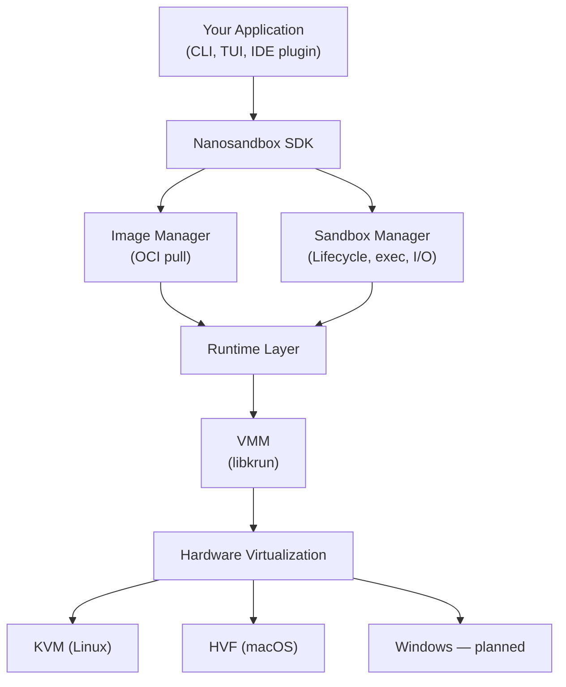
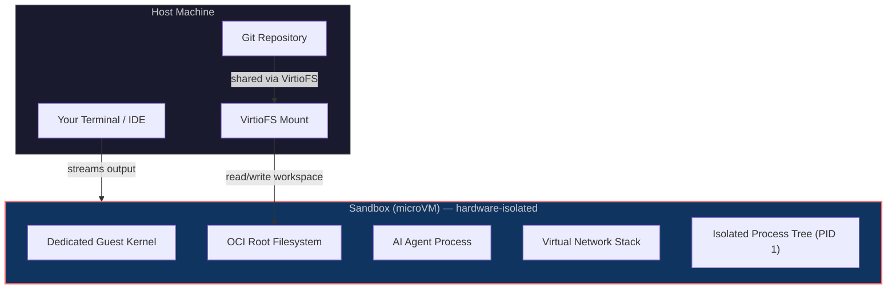

# How We See Sandboxing Today

*When your code is written by a machine that hallucinates, the walls around it had better be real.*

---

## The Problem No One Saw Coming

Software development is undergoing a quiet revolution. AI coding agents — Claude, Codex, Cursor, Goose — are no longer autocomplete toys. They clone repositories, install dependencies, execute shell commands, modify files, spin up servers, and interact with external APIs. They do all of this autonomously, interpreting natural language instructions and making probabilistic decisions about what to run next.

That last part is the problem.

A traditional CI pipeline runs a deterministic script you wrote and reviewed. An AI agent runs whatever it *thinks* you meant. It reads your entire codebase for context, decides which tools to invoke, and executes commands with the permissions you gave it. There have been documented cases of autonomous coding agents misinterpreting cleanup instructions and deleting production data, or being coerced through prompt injection into performing unintended actions.

These aren't theoretical risks. The OWASP Foundation published its first-ever Top 10 for Agentic Applications, listing threats like "Agent Goal Hijack" (ASI01) and "Unexpected Code Execution" (ASI05) among the most critical risks. Multiple AI coding tools have disclosed vulnerabilities where malicious repository configurations could trigger arbitrary code execution on collaborators' machines.

The question is no longer *whether* to sandbox AI agents. It's *how well*.

---

## A Quick Tour of How Sandboxing Works Today

Before we get to our approach, let's understand what's already out there. The sandboxing landscape for AI agents spans a wide spectrum — from lightweight process isolation to full hardware virtualization.

### Level 0: No Isolation (The Brave and the Reckless)

Many developers today run AI agents directly on their host machines. The agent has the same file access, network access, and permissions as the developer. This is fast and convenient. It is also one hallucinated `rm -rf /` away from disaster.

### Level 1: Containers (Docker, Podman)

Containers are the de facto standard for isolating workloads. They use Linux namespaces (PID, network, mount, user) and cgroups to create the illusion of a separate environment. An agent running inside a Docker container sees its own process tree, its own filesystem, and its own network stack.

**The catch**: every container on the same host shares the same Linux kernel. The kernel exposes hundreds of system calls as entry points. A vulnerability in any one of them can break through the container boundary.

This is not theoretical. There have been multiple high-severity vulnerabilities disclosed in runc — the runtime that underpins Docker and most Kubernetes deployments — that exploit the shared `/proc` filesystem to achieve full container escapes. An attacker with the ability to create containers with custom mount configurations (exactly what AI agent platforms do) could overwrite kernel parameters to execute arbitrary code as root on the host.

Containers are a wall. But the wall is built on a shared foundation, and cracks in that foundation compromise everyone.

### Level 2: Syscall Interception (gVisor)

Google's gVisor takes a different approach. Instead of letting container workloads talk directly to the host kernel, gVisor interposes a user-space "Sentry" process that reimplements Linux system calls in Go. The application thinks it's talking to a Linux kernel, but it's actually talking to a Go program that carefully filters and re-executes only the operations it considers safe.

gVisor implements a large subset of Linux syscalls and integrates with Kubernetes. Google Cloud uses it for their Agent Sandbox product on GKE, and Modal uses it for their serverless sandbox platform.

**The trade-off**: gVisor adds overhead for syscall-heavy workloads (like compilation or heavy I/O). It doesn't implement the full Linux kernel surface, so some workloads simply won't run. And while it dramatically reduces the attack surface compared to raw containers, the Sentry itself runs in the host kernel's address space — it's a software boundary, not a hardware one.

### Level 3: MicroVMs (Firecracker, Kata Containers)

This is where the architecture fundamentally changes. A microVM is a stripped-down virtual machine that boots its own Linux kernel, managed by a minimal Virtual Machine Monitor (VMM). The workload runs inside a complete, isolated operating system — with its own address space, its own kernel, its own memory, enforced by hardware virtualization (Intel VT-x, AMD-V, or ARM's Hypervisor Framework).

**Firecracker**, built by AWS in Rust, powers Lambda and Fargate. It emulates only five devices (virtio-net, virtio-block, virtio-vsock, serial console, keyboard controller) and has a minimal codebase — compare that to QEMU's much larger C codebase.

**Kata Containers** wraps microVMs in the Kubernetes container interface, so you can schedule VM-isolated pods alongside regular containers. It supports QEMU, Cloud Hypervisor, and Firecracker as backend VMMs.

**E2B** is the most visible AI-focused platform using this approach. Built on Firecracker, E2B provides sandboxes with dedicated kernels, JavaScript and Python SDKs, and pre-built templates for agent frameworks. Each sandbox is ephemeral: spin up, execute, destroy.

**Daytona** offers a similar model: OCI-compliant sandboxes with dedicated kernels, per-sandbox firewall rules, and SDKs in Python, TypeScript, Ruby, and Go.

The microVM approach eliminates the shared-kernel attack surface entirely. A kernel exploit inside a microVM compromises only that microVM's guest kernel — the host and all other workloads are protected by hardware-level memory isolation enforced by the CPU itself.

---

## The Landscape at a Glance

| Approach | Isolation | Kernel | Attack Surface |
|---|---|---|---|
| **No isolation** | None | Shared | Entire host |
| **Containers** | Namespaces + cgroups | Shared | Shared kernel (hundreds of syscalls) |
| **gVisor** | User-space kernel | Intercepted | Sentry process + partial kernel |
| **Firecracker** | Hardware (KVM) | Dedicated | Minimal VMM codebase |
| **Kata Containers** | Hardware (KVM/QEMU) | Dedicated | VMM + QEMU |
| **Nanosandbox** | Hardware (KVM/HVF) | Dedicated | VMM (libkrun) |

---

## So Why Build Nanosandbox?

The solutions above are impressive. E2B and Daytona prove that microVM sandboxing works for AI agents. Firecracker proves that microVMs can be fast. So why did we build something new?

Because we needed something none of them provide: **a local-first, cross-platform SDK that gives you VM-level isolation as a library call, not a cloud API.**

### The Cloud Lock-In Problem

E2B, Daytona, and Modal are cloud services. Your agent's code, your repository, and your execution data travel to their infrastructure. For many teams — especially those working with proprietary code, regulated industries, or air-gapped environments — this is a non-starter. You don't want your AI agent running your private codebase on someone else's servers.

### The Platform Problem

Firecracker requires KVM, which means Linux only. No macOS. No Windows. If you're a developer on a MacBook (and most are), Firecracker isn't an option without a Linux VM — at which point you're nesting VMs, which defeats the purpose.

### The Integration Problem

Firecracker is a standalone process with a REST API. Kata Containers requires a full Kubernetes setup. Neither is designed to be embedded into a CLI tool or a desktop application. They solve infrastructure problems, not developer experience problems.

---

## The Nanosandbox Architecture

Nanosandbox takes a different path. It's an SDK that provides VM-level isolation using **libkrun** — a lightweight microVM library from the Containers project — as the Virtual Machine Monitor.



### What Makes This Different

**1. It's a library, not a service.** You embed it into your application. There's no daemon to manage, no REST API to configure, no cloud account to create.

**2. It runs on your machine.** Your code never leaves your hardware. On macOS, it uses Apple's Hypervisor.framework (HVF) and is production-ready today. Linux (KVM) support is in active development with the same architecture. Windows support is planned.

**3. It speaks OCI natively.** Nanosandbox pulls container images from Docker Hub, GHCR, or any OCI-compliant registry. No Docker daemon required. No containerd. The image layers are extracted, merged into a root filesystem, and passed directly to the microVM.

**4. Each sandbox is a real VM.** Every sandbox gets its own Linux kernel, its own virtual CPUs, its own memory, its own network stack. A kernel exploit inside sandbox A cannot affect sandbox B or the host.

### How It Works

When you start a sandbox, Nanosandbox spawns a dedicated child process that becomes the microVM. The parent process captures the VM's output and streams it back to the caller. Each VM boots its own guest kernel and runs in complete isolation from the host and from other sandboxes.

### Isolation in Depth



**Filesystem isolation**: The guest sees an OCI-derived root filesystem with VirtioFS mounts for the project workspace. VirtioFS is a paravirtualized filesystem that avoids the overhead of block device emulation. Sensitive host paths are masked or mounted read-only following OCI runtime spec conventions.

**Network isolation**: The preferred mode uses a user-mode virtual network with DHCP, DNS, and routing. A fallback mode proxies sockets through the host for environments where the virtual network isn't available. Network scope is configurable: no network, group-only, public, or full access.

**Resource limits**: Memory, CPU, PID count, and file descriptor limits are enforced per sandbox. Privilege escalation is blocked by default, and Linux capabilities are reduced to the minimum needed set.

**Process isolation**: Every sandbox runs with a reduced capability set. Each VM has its own init process and process tree. There's no shared kernel, no shared `/proc`, no shared cgroup hierarchy.

---

## What Nanosandbox Is Built For

The primary use case is running AI coding agents safely within your git repositories. Here's how that works in practice:

### The Git Repository Workflow

1. **Pull**: `nanosb pull ghcr.io/nanosandboxai/claude` downloads an OCI image containing Claude Code and its dependencies.
2. **Run in your repo**: `nanosb` boots a microVM from that image. The VM has its own kernel, isolated network, and a VirtioFS mount of your project directory — the agent sees your git repository as its workspace.
3. **Branch-aware execution**: The agent works within your repository context. It can read your code, create branches, write files, execute commands, install packages — all within the sandbox boundary. Changes are written back to your host via VirtioFS, so git sees them as normal modifications.
4. **Stream**: Output streams back to your terminal in real time.
5. **Review and commit**: When the agent is done, you review the changes in your repository as you would any other code change — `git diff`, `git add`, `git commit`. The sandbox gave the agent freedom to execute; your git workflow gives you control over what ships.
6. **Stop/Destroy**: The VM is killed and the sandbox is destroyed. No state leaks.

### Try It

Drop a `sandbox.yml` in your repository root to define your sandboxes:

```yaml
defaults:
  cpus: 2
  memory: 4096
  timeout: 600

sandboxes:
  claude:
    image: claude
    env:
      ANTHROPIC_API_KEY: ${ANTHROPIC_API_KEY}
    mcp:
      github:
        command: npx
        args: ["-y", "@modelcontextprotocol/server-github"]

  codex:
    image: codex
    cpus: 4
    env:
      OPENAI_API_KEY: ${OPENAI_API_KEY}
```

Then from your terminal:

```terminal
# Check that your machine meets the prerequisites
$ nanosb doctor
  ✓ libkrun: found at /opt/homebrew/lib/libkrun.dylib
  ✓ Hypervisor.framework: available
  ✓ gvproxy: found

# Pull the agent image
$ nanosb pull ghcr.io/nanosandboxai/claude
  Pulling ghcr.io/nanosandboxai/claude...
  ████████████████████████████████ 100%
  ✓ Image cached locally

# Launch the TUI — auto-detects sandbox.yml
$ nanosb
  ✓ Loaded sandbox.yml (2 sandboxes)
  ✓ Sandbox claude created
  ✓ Sandbox codex created
  Starting TUI...
```

Each command boots a real microVM. The agent runs inside it. Your code stays on your machine.

### Persistent Mode

For longer sessions, Nanosandbox supports persistent sandboxes. The VM stays running and provides:

- SSH access with ephemeral key pairs
- MCP (Model Context Protocol) integration for tool access
- Session management with save/restore
- Port forwarding for development servers

### Multi-Agent TUI

The TUI mode lets you run multiple agents side by side in a terminal interface. Each agent runs in its own microVM. You can `/add claude`, `/add goose`, split panels, and switch focus. Each agent has its own isolated environment, its own filesystem, its own network — but they can all mount the same project directory via VirtioFS, working on the same git repository concurrently.

---

## The Isolation Spectrum: A Real Comparison

Let's be concrete about what each approach protects against:

| Threat | No Isolation | Container | gVisor | Cloud MicroVM (E2B) | Nanosandbox |
|---|---|---|---|---|---|
| `rm -rf /` destroying host | Vulnerable | Protected | Protected | Protected | Protected |
| Kernel exploit (e.g., Dirty Pipe) | Vulnerable | **Vulnerable** | Partial | Protected | Protected |
| `/proc`-based container escape | Vulnerable | **Vulnerable** | Protected | Protected | Protected |
| Network exfiltration | Vulnerable | Configurable | Configurable | Configurable | Configurable |
| Side-channel attacks (Spectre) | Vulnerable | **Vulnerable** | **Vulnerable** | Protected | Protected |
| Supply chain (malicious deps) | Vulnerable | Contained | Contained | Contained | Contained |
| Code leaves your machine | No | No | No | **Yes** | **No** |
| Works on macOS (native) | Yes | Via VM | No | N/A (cloud) | **Yes (HVF)** |
| Works on Linux (native) | Yes | Yes | Yes | N/A (cloud) | In development (KVM) |
| Works on Windows (native) | Yes | Via WSL | No | N/A (cloud) | Planned |

The critical column is the second one. Containers protect against simple escapes but fall apart against kernel-level attacks — the exact kind of attacks that matter when running untrusted, AI-generated code.

> **Note**: Nanosandbox is production-ready on macOS today. Linux (KVM) support is in active development with the same architecture. Windows support is planned.

---

## The Road Ahead

Nanosandbox is production-ready on macOS with HVF today. Here's what's coming next:

- **Linux Runtime Hardening**: The KVM runtime is functional but still in active development. Reaching production-grade parity with the macOS runtime is a top priority.
- **Windows Support**: We're planning Windows support. More details in our [What's Coming Next](/coming-soon/whats-coming-next) post.

---

## Closing Thoughts

The AI agent revolution is happening whether we're ready or not. Agents will write code, execute it, deploy it, debug it, and iterate — all with minimal human oversight. The question isn't whether to give them execution environments. It's whether those environments are built for the threat model.

Containers were designed to isolate trusted workloads from each other. They were never designed to protect a host from an unpredictable, autonomous agent executing arbitrary code. The shared kernel is not a theoretical weakness — it's a proven, repeatedly exploited attack surface.

MicroVMs fix this by giving each workload its own kernel, enforced by hardware virtualization. Nanosandbox makes this accessible: local-first, cross-platform, embeddable as a library, compatible with standard OCI images, and purpose-built for AI coding agents.

The walls around your AI agent should be made of silicon, not software.

---

## Sources

- [OWASP Top 10 for Agentic Applications (2026)](https://genai.owasp.org/resource/owasp-top-10-for-agentic-applications-for-2026/) — ASI01 Agent Goal Hijack, ASI05 Unexpected Code Execution, and the full agentic threat taxonomy.
- [runc Container Escape Vulnerabilities (November 2025)](https://github.com/opencontainers/runc/security/advisories) — CVE-2025-31133, CVE-2025-52565, CVE-2025-52881: `/proc`-based container escapes via custom mount configurations.
- [Dirty Pipe — CVE-2022-0847](https://dirtypipe.cm4all.com/) — Linux kernel vulnerability (5.8+) allowing arbitrary file overwrites, bypassing container isolation.
- [Firecracker: Lightweight Virtualization for Serverless Computing](https://firecracker-microvm.github.io/) — AWS's microVM monitor written in Rust, powering Lambda and Fargate. Emulates five devices: virtio-net, virtio-block, virtio-vsock, serial console, keyboard controller.
- [gVisor — Application Kernel for Containers](https://gvisor.dev/) — Google's user-space kernel reimplementing Linux syscalls in Go.
- [Google Cloud Agent Sandbox on GKE](https://cloud.google.com/kubernetes-engine/docs/how-to/agent-sandbox) — gVisor-based isolation for AI agent workloads on Kubernetes.
- [Modal Sandboxes](https://modal.com/use-cases/sandboxes) — Serverless sandbox platform using gVisor containers.
- [E2B — Cloud Sandboxes for AI Agents](https://e2b.dev/) — Firecracker-based ephemeral sandboxes with JavaScript and Python SDKs.
- [Daytona — Infrastructure for AI-Generated Code](https://www.daytona.io/) — OCI-compliant sandboxes with per-sandbox firewall rules and SDKs in Python, TypeScript, Ruby, and Go.
- [Kata Containers](https://katacontainers.io/) — MicroVM-isolated containers for Kubernetes, supporting QEMU, Cloud Hypervisor, and Firecracker as backend VMMs.
- [libkrun — containers/libkrun](https://github.com/containers/libkrun) — Lightweight microVM library from the Containers project, providing KVM (Linux) and HVF (macOS) virtualization.

---

*Nanosandbox is open source. Find us at [github.com/nanosandboxai](https://github.com/nanosandboxai).*
