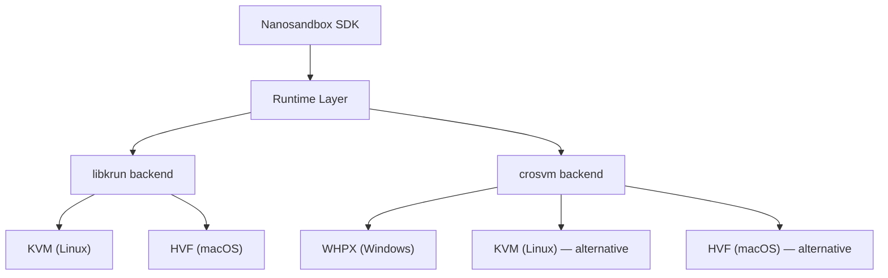

# What's Coming Next

*A look at what we're building next for Nanosandbox.*

---

## Windows Support with crosvm

Nanosandbox is production-ready on macOS today, using Apple's Hypervisor.framework through libkrun. Linux support via KVM is in active development using the same libkrun backend. The next big step is **Windows**.

### Why crosvm?

On macOS and Linux, Nanosandbox uses [libkrun](https://github.com/containers/libkrun) as the Virtual Machine Monitor — a lightweight microVM library that talks to KVM (Linux) or Hypervisor.framework (macOS) to boot isolated VMs with dedicated kernels. For Windows, we're planning to use [crosvm](https://crosvm.dev/book/) as the VMM backend.

crosvm is Google's Virtual Machine Monitor, originally built for Chrome OS to run Linux and Android guests. It's written in Rust, focused on security, and designed with strong isolation — every virtual device runs in its own sandbox with syscall filtering. It supports multiple hypervisor backends, including Windows' WHPX (Windows Hypervisor Platform).

Here's why crosvm fits:

- **Rust-native**: Like the rest of Nanosandbox, crosvm is written in Rust. This means we can integrate it as a library dependency rather than shelling out to external processes.
- **Security-first design**: crosvm isolates virtual devices in individual sandboxes with syscall filters — the same defense-in-depth philosophy we apply to AI agent sandboxing.
- **Cross-platform hypervisor abstraction**: crosvm already abstracts over KVM, Hypervisor.framework, and WHPX, giving us a path to support all three major platforms with a single VMM backend.
- **Active development**: crosvm is actively maintained by Google and used in production across Chrome OS, Android (ARCVM), and other Google products.

### What This Means for the Architecture

The Nanosandbox SDK will gain a second runtime backend alongside libkrun:

The API stays the same — `Sandbox::new()`, `sandbox.start()`, `sandbox.exec()`. The runtime backend is selected automatically based on the platform, or can be configured explicitly. Your `sandbox.yml` files, your OCI images, and your workflow don't change.

### What This Means for Users

- **Windows developers** will be able to run AI coding agents in hardware-isolated VMs on their machines, without needing WSL or a Linux VM
- **The same `nanosb` CLI and TUI** will work on Windows — same commands, same multi-agent panels, same git repository workflow
- **Cross-platform teams** can standardize on Nanosandbox regardless of what OS each developer runs

### Current Status

Windows support is in the planning and early development phase. The runtime already has Windows-specific code paths for image management and platform validation. The crosvm integration is the next step.

We'll share more as development progresses.

---

*Nanosandbox is open source. Find us at [github.com/nanosandboxai](https://github.com/nanosandboxai).*
